# COVID DATA

## Tema: Salud Mundial

### Este dataset contiene grandes cantidades de datos realacionados a pacientes que obtuvieron ciertas caracteristicas y antecedentes al ingresar a la atencion medica.

### El conjunto de datos sin procesar consta de 21 características únicas y 1.048.576 pacientes únicos. En las características booleanas, 1 significa "sí" y 2 significa "no". valores como 97 en adelante son valores no definidos.

## - Informacion para entender el dataset.

#### sex: 1 mujer y 2 hombre.

#### age: edad del paciente.

#### classification: Valor 1-3 significa variante de covid de menor a mayor fuerza.

#### degrees. 4 significa que el paciente no fue tratado con covid antes.

#### patient type: tipo de pacitente. 1 retorno a la casa o 2 se quedo internado.

#### pneumonia: indica si tuvo neumonia.

#### pregnancy: indicaba si estaba embarazada.

#### diabetes: indica si tenia diabetes o no.

#### copd: indica si el paciente tenia el pulmon obstruido.

#### asthma: indica si tenia asma.

#### inmsupr: inidca si podia respirar o no.

#### hypertension: indica si tenia hypertension o no.

#### cardiovascular: indica si tenia enfermedad cardiovascular.

#### renal chronic: indica si tenia enfermedad renal.

#### other disease: indica si tenia otras enfermedades.

#### obesity: indica si tenia obesidad.

#### tobacco: indica si fumaba.

#### usmr: indicaba prioridad a ser tratado.

#### medical unit: indicaba de donde provenia.

#### intubed: indica si fue intubado.

#### icu: indica si estuvo en cuidados intensivos.

#### date died: indica fecha de la muerte.

# Graficos y conclusiones

1. La edad en la que muriero mas personas en el covid fue entre 55 años y 75 años por motivo de la intubacion en las UCI.

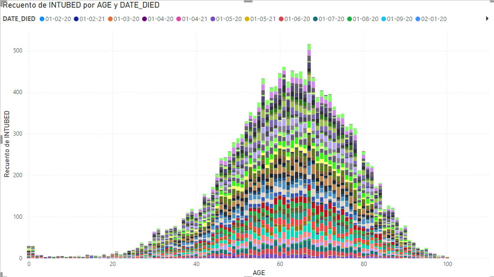

2. La mayoria de las personas que murieron fue por su obesidad independientemente de su edad.

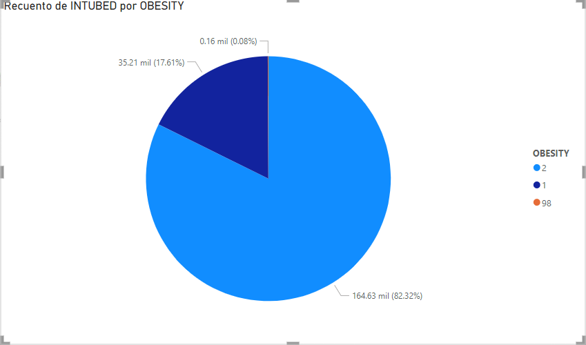

3. Los hombres fueron los que estuvieron mas veces internadas en la UCI aun asi no tanto como los hombres.

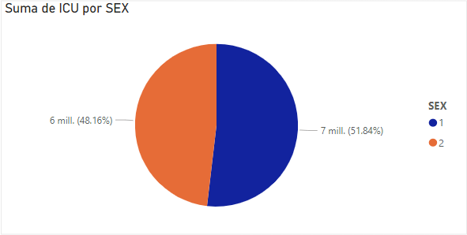

4. Los pacientes que ingresaron tenian neumonia la mayor parte mujeres.

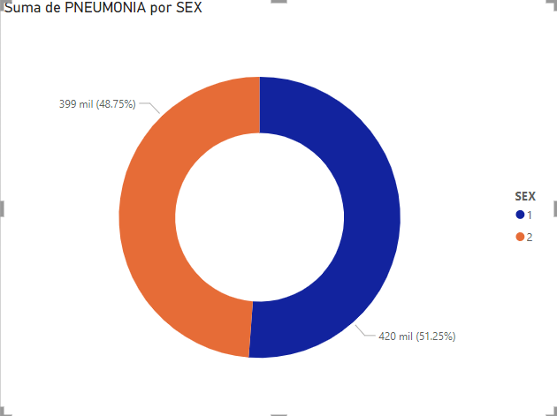

5. El 18.6% no murio porque tenia enfermedad cardiaca en cambio el 0.47% murio teniendo enfermedades cardiacas.

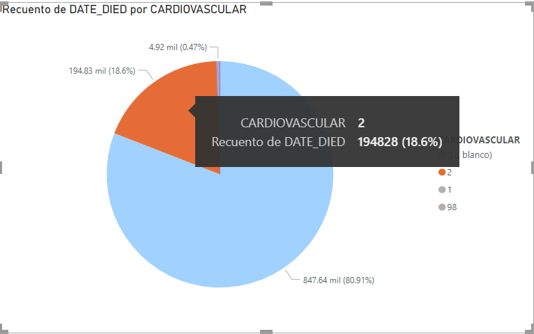

6. El 14.6% que murio no tenia neumonia cuando entro y el 4.04 si la tenia.

7. El 15.79% de los que muerion no tenia diabetes cuando entro al hospital y el 3.28 si la tenia.

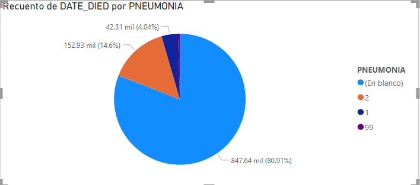

8. El 65.34% de los que fumaban tuvieron que ser entubados por riesgo cronicos, en cambio el 25.33% de los que fumaban no fueron entubados.

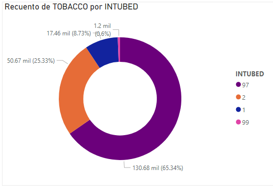

9. El 97.81 que estuvo en UCI no tenia antes problemas en los pulmones independiente de lo que hayan hecho, en cambio el resto si.

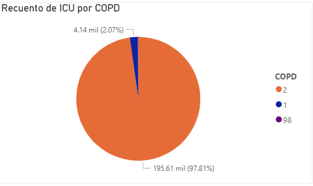

10. Vemos que entre el rango de 20 a 40 años de edad los pacientes tenian antecendentes de fumar tabaco lo cual tenia un mayor indice de riesgo a morir.

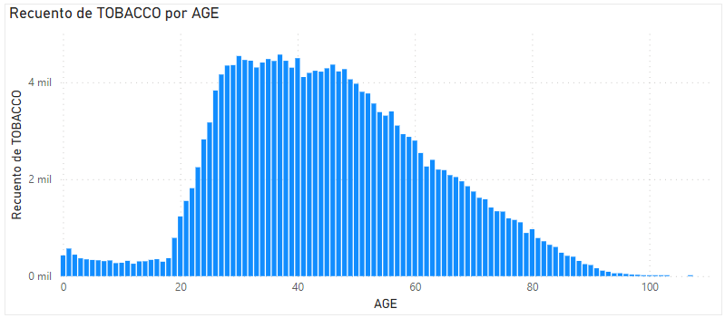

11. Segun este grafico los enfermos masculinos tenian la tendencia a ser obesos entre el rango de 20 a 40 años, en cambio las mujeres entre el rango de 20 a 35 años.

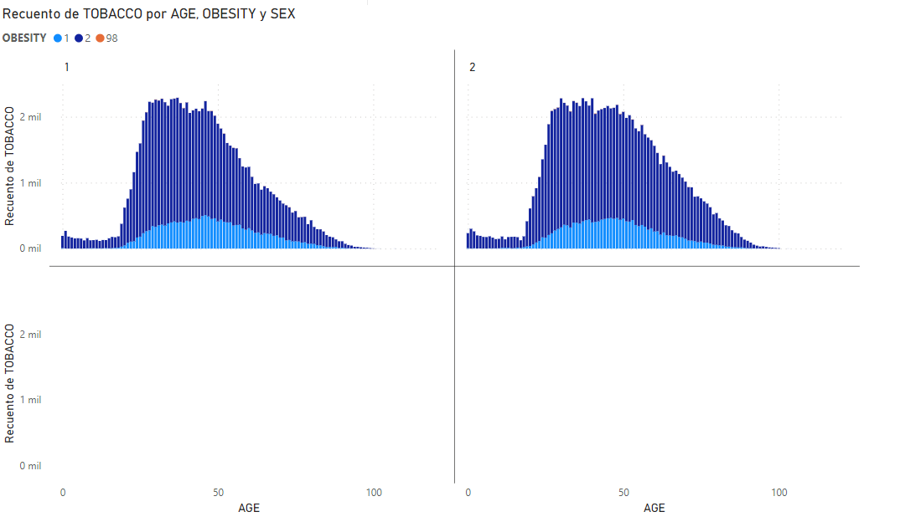

12. Segun el grafico las personas con diabetes que murieron por el covid fueron entre el rango de edade de entre 60 a 80 años. Siendo 65 años el punto mas alto.

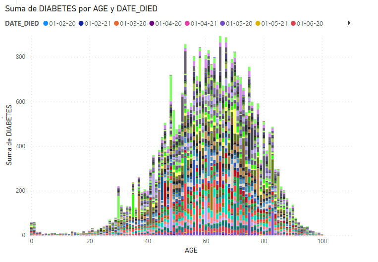

13. Las personas entre el rango de 20 a 40 años con problemas reanales tiene mas probablilidad a morir por el covid 19.

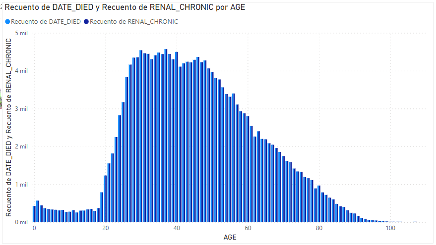

14. El riesgo de tener complicaciones por otras enfermedades se presento entre el rango mas alto de 28 a 48 años.

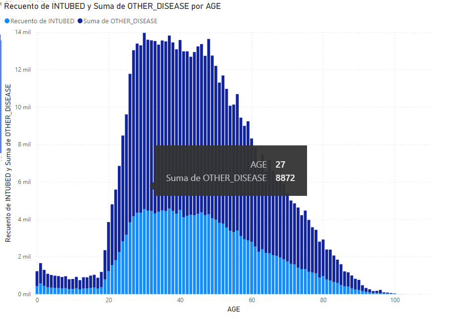

15. Pese a que la muerte del covid se produce por sintomas de los pulmones en el caso de la asma solo el 0.58% murio por haber tenido asma.

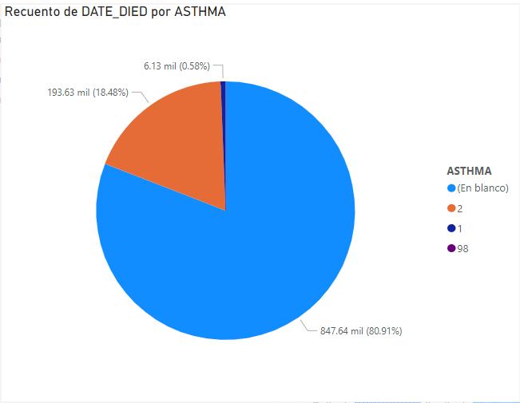
